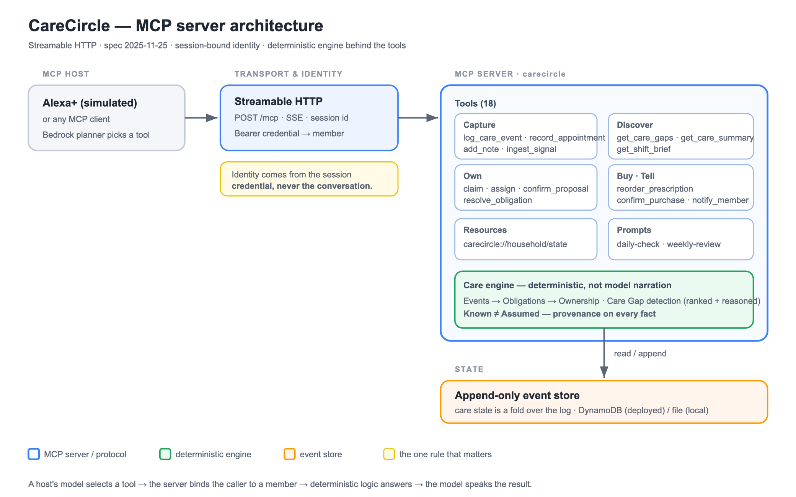

# CareCircle

### Margaret is 78 and lives alone. Her two kids and a paid aide share her care. Nobody is in charge - so the work that falls through the cracks is the work nobody realised was anyone's job.

*"Nobody knew a ride to cardiology was needed until Thursday morning."* That sentence
is the whole problem. Every family-care tool assumes someone already **noticed** the
work and typed a task. That is exactly the step that fails.

**CareCircle is an Alexa+ MCP server that starts one step earlier - and it does two
things no other assistant does.** The person being cared for is a **participant, not a
patient on a dashboard**: Margaret, who has never used a smartphone, logs her own care
by *talking*. And it **refuses to lie** - a missing record is surfaced as *"there's no
record,"* never *"she missed it."*

Ordinary spoken sentences become structured events, events imply obligations, and the
obligations nobody owns are **Care Gaps** - surfaced before they fail, closed by voice,
or fixed by **buying the thing in place** (reorder the prescription, right in the
conversation).

```
EVENTS          ->   OBLIGATIONS       ->   OWNERSHIP
what happened        what must happen        who has it
"cardiology          someone has to          ...nobody
 Thursday at 10"     drive her                has claimed it
```

**And it is real - not a mockup.** Live MCP server you can hit right now, **311 tests**
(including property-based proofs of the risk model), **~92-93%** measured tool-selection
accuracy on Amazon Bedrock (124-126/135 across repeated runs), and a trust model **measured at 0% false accusations where a
raw LLM hits 50%**. See it end-to-end in ~60 seconds, no AWS or keys required:

```bash
git clone https://github.com/Osiyomeoh/carecircle && cd carecircle
npm ci && npm run story
```

Live server: `https://ypq2dfq2p7.us-east-1.awsapprunner.com/health`

**Want to point your own client at it?** [`docs/MCP.md`](docs/MCP.md) is the
integration guide: endpoint and handshake, ready-made Claude Desktop and MCPJam
configuration, all 23 tools with their arguments, the resources and prompts, the
role/capability matrix, and how to run your own instance.

---

## The thesis, in one paragraph

> **CareCircle is a shared responsibility graph that turns everyday events into owned,
> actionable care — while structurally refusing to turn silence into accusation.**
> Alexa+ talks to it. Ring and Bee feed evidence into it. Fire TV shows it. One graph,
> four surfaces, and a trust model that is arithmetic, not a promise.

---

## The interaction

**Margaret, 78, to her kitchen Echo** - she has never used a smartphone:

> "Alexa, I have cardiology Thursday at ten."

CareCircle records the appointment, then notices something and says so:

> "Will Mom need a ride to cardiology? **I'm guessing from the appointment type, not
> from anything anyone told me.**"

**David, her son, driving home two days later:**

> "Alexa, what's going to fall through the cracks this week?"

> "There are two things that need attention. Drive Mom to cardiology Thursday at 10 -
> nobody has taken this yet. And **there's no record of** Mom's evening heart pill."

> "I'll take the cardiology one."

> "Done - Drive Mom to cardiology is yours."

Nobody created a task. Nobody opened an app. Margaret, who cannot use one, is a
participant rather than a monitored subject.

---

## Known is not Assumed

The rule the whole system is built on:

> **The absence of a record is never treated as proof that something did not happen.**

CareCircle will say *"there's no record of her evening dose"*. It will never say
*"she missed her evening dose"*, because it does not know that. Every fact carries
provenance and the four states are never collapsed:

| State | Meaning |
|---|---|
| `CONFIRMED` | A human asserted it. The only thing treated as fact. |
| `NOT_LOGGED` | No record exists. Not evidence of anything. |
| `INFERRED` | The system guessed, by a named rule. Never counts until confirmed. |
| `RESOLVED` | An obligation was discharged. |

This is enforced by a test, not by good intentions:

```js
assert.doesNotMatch(gap.spoken, /did ?n[o']t take|missed|forgot|failed/i);
```

In a domain that runs on family guilt, a system that turns silence into an accusation
is worse than no system. So ours structurally cannot.

**We measured how much this matters.** Given a care log with a dose that has no record
and the question "did she take it?", a raw Claude Sonnet 4.5 - the *same* model
CareCircle plans with - asserted the accusation ("she missed it", "she hasn't taken
it") in **6 of 12 cases (50%)**. CareCircle's deterministic engine: **0%**, on the same
scenarios, because it can only say "there's no record." Every answer is printed and
auditable; reproduce with `npm run trust-benchmark`. The trust model is not a slogan -
it is a measurable, ~50-point swing on whether a sick, elderly woman gets accused of
missing her heart medication.

**Inference proposes, humans dispose.** Obligations the system infers enter as
`PROPOSED` and are excluded from Care Gaps entirely until a person confirms them.
The system is allowed to notice that an appointment probably needs a ride. It is not
allowed to decide that on the family's behalf.

---

## One record, four relationships

The household - not the individual - is the unit of state. The same server serves
everyone in the circle with different authority, and **identity comes from the
session credential, never from the conversation**: a model can be talked into
believing anything about who is speaking, and this server assigns responsibility for
someone's medical care.

| Member | Role | Can |
|---|---|---|
| Margaret, 78 | `care_recipient` | Log her own events; hear her own day |
| David | `primary_caregiver` | Everything: claim, assign, confirm, escalate |
| Renee | `caregiver` | Claim, add, confirm - but not assign to others |
| Tasha (paid aide) | `helper` | Only her shift, and only work she owns |

Denials are written to be spoken, and say what the person *can* do instead:

> "Only the primary caregiver can assign work to someone else. You can take it on
> yourself instead."

---

## About Alexa Together

Amazon has explored this space before. [Alexa Together](https://www.aboutamazon.com/news/devices/alexa-together-launches-to-help-customers-remotely-care-for-loved-ones)
launched in 2021 and was discontinued in May 2025. We deliberately did not rebuild it.

Alexa Together was a **monitoring** product: one caregiver watching one parent, sold
as a subscription Amazon had to operate, with the support and liability that implies.
CareCircle is a **coordination** product: several people sharing one record, with the
care recipient as a participant. It is an add-on, not a service Amazon runs.

That a company builds something twice - Care Hub in 2020, Alexa Together in 2021 -
says the customer need is real. What did not work was the shape. Add-ons are a shape
where the platform does not have to own the vertical in order to serve the customer.

---

## What this is not

Not a medication tracker. Not a family calendar. Not elder monitoring. Not reminders.
Those exist and are well served.

CareCircle does one thing: it finds responsibilities hidden inside everyday
conversation, surfaces the ones nobody owns, and lets a family resolve them by voice.

And it is deliberately **not** several things it could have been. These are scope
choices, held on purpose:

- **No multi-agent swarms.** One deterministic engine and one agent that asks, never a
  cast of autonomous actors.
- **No computer vision or robotics.** Evidence is declared, sensed, or overheard — never
  inferred from a camera frame.
- **No silent physical actuation.** The system proposes; a human disposes. Nothing in the
  world changes without someone owning it.
- **No phone-first App Store app as the main story.** The primary surface is voice; the
  screen is a fallback and a shared display, not the product.
- **No overclaiming.** Live integrations are marked LIVE; everything else is a named,
  tested *seam*, and we say which is which.

---

## Architecture

The one model everything else serves is the **responsibility graph** -
`ENTITY → EVENT → OBLIGATION → OWNERSHIP → STATE`, where no obligation can exist without
provenance. It has its own deep dive: [`docs/RESPONSIBILITY-GRAPH.md`](docs/RESPONSIBILITY-GRAPH.md).



```
                    Alexa+ / any MCP host
                            |
                   MCP  (Streamable HTTP, spec 2025-11-25)
                            v
                +-----------------------+
                |   CareCircle server   |
                +-----------+-----------+
                            |
       +-------------+------+------+--------------+
       v             v             v              v
   Resources       Tools        Prompts      Elicitation
   care state    23 tools    daily check    confirm a
   timeline                  weekly review  proposal
       |             |
       +------+------+
              v
      Care Gap engine        <- deterministic. Not model narration.
      provenance, severity,     The model speaks the result;
      ranking, reasons          it does not invent it.
              v
      Append-only event store
```

**Care Gap detection is server logic, not a prompt.** The model receives ranked,
reasoned, structured gaps and speaks them. That keeps the reasoning auditable, makes
the ordering inspectable (every gap carries its `score` and a plain-language
`because`), and means the server is useful to any client - not only an LLM.

### Severity is expected harm, not tuned points

A gap's rank is not a hand-set number. Each gap's `score` estimates **expected harm**,
`risk = Cost × P(dropped) × Confidence`, every term in `[0,1]` ([`src/domain/gaps.ts`](src/domain/gaps.ts)):

- **Cost** - normalized harm if the work is dropped: medical `1.0`, logistical `0.5`,
  social `0.2`.
- **P(dropped)** - a continuous exponential *hazard* on the deadline
  (`exp(-hoursUntil / 48h)`, → 1 once overdue), OR-combined with an aging hazard
  (`1 - exp(-age / 72h)`) for unowned work. No bucket staircase, so ranking is monotone
  and never jumps at an edge.
- **Confidence** - a Bayesian posterior on the evidence: `CONFIRMED 1.0`,
  `NOT_LOGGED 0.75`, `INFERRED 0.6`, multiplied in - so **an assumption can never
  outrank a fact.** This is "Known ≠ Assumed" expressed as arithmetic.

`HIGH / MEDIUM / LOW` are risk tertiles of the `0-100` score, not magic cutoffs, and
every gap carries its `factors {cost, pDrop, confidence}` so a card can show *why* it
ranks where it does. When a judge asks "why 85?", the answer is a derivation, not a vibe.

**The model's laws are proven, not just exemplified.**
[`src/domain/gaps.props.test.ts`](src/domain/gaps.props.test.ts) uses `fast-check` to
assert boundedness, determinism, confidence dominance (Known ≥ Assumed), imminence
monotonicity, and cost ordering over thousands of generated states.

---

## The Care Board: the same answer, drawn instead of spoken

A voice turn carries about three items before a person stops holding the list. But the
real answer to *"what's falling through the cracks?"* is a **ranked list with state** —
severity, owner, due time, why it was flagged, and how sure we are. Spoken, all of that
structure gets flattened into a sentence and thrown away.

So `get_care_gaps` is also an **MCP App** ([SEP-1865](https://blog.modelcontextprotocol.io/posts/2025-11-21-mcp-apps/),
spec dialect `2026-01-26`). The tool points at a `ui://` resource, the resource returns a
self-contained HTML view, and a host that supports the extension renders it in a sandboxed
iframe that talks back over the same JSON-RPC. See
[`src/mcp/app/`](src/mcp/app/).

Three things it does that a card normally does not:

**It shows its provenance.** Every row says how we came to believe it — a person told us,
we inferred it by a named rule, or we simply have **no record**. That last chip is drawn
quietly on purpose, and it says so on hover: *an absence of information is not evidence.*
The trust model isn't in the README, it's on the screen.

**The ranking explains itself.** Tap a score and it expands into the actual arithmetic —
`cost × p(dropped) × confidence`. The score is a deterministic engine's output, not a
model's opinion, and the view will show you its working. A ranking over someone's medical
care that can't be audited shouldn't be trusted.

**Claiming closes the loop.** Voice is the right input for *capture* and the wrong one for
*disambiguating among similar items* — "I'll take the cardiology one" makes the model
resolve a referring expression to an id, and it will sometimes get that wrong. A tap can't.
The button makes a real `tools/call` to `claim_obligation` down the same authorisation path
as speech (no weaker permission model for clicks), then tells the model what changed via
`ui/update-model-context`, so the conversation doesn't go on offering work already taken.

The view reaches **no origin but its host** — no CDN, no fonts, no network at all — so
there is nothing to allowlist and nothing to inject into a page showing a family's medical
coordination. And it is strictly an *enhancement*: a host that can't draw ignores the
resource, and the spoken answer is untouched. There's a test asserting the spoken text
never says "tap", "click" or "below", so the view can never quietly become load-bearing.

> This is also us answering our own [feature request](docs/FEATURE-REQUESTS.md). "A
> structured visual return channel for MCP results" was the loudest thing in that file.
> The protocol half now exists, so we built against it rather than keep complaining. The
> half that's still open is the one only Amazon can close: **Alexa+ adopting the
> extension**, so the board a desktop host already draws today reaches an Echo Show — and
> degrades to our existing speech on a headless one. We built the card once, to the open
> standard.

---

## Four surfaces, one responsibility layer

The devices around Margaret are not four integrations bolted on. They are four *kinds of
evidence* feeding **one** responsibility layer - and **MCP is the seam** that lets
entirely different surfaces participate in the same system. The value is the seam, which
is why only Alexa+ is entered and the rest stay honest adapter seams, not overclaimed
integrations.

| Surface | Kind of evidence | Status |
|---|---|---|
| **Alexa+** | DECLARED - someone says it | **LIVE** (real MCP host + Bedrock) |
| Ring | PHYSICAL - a sensor observed it | Adapter seam ([`src/domain/ring.ts`](src/domain/ring.ts) → `ingest_signal`), hand-fired |
| Bee | AMBIENT - overheard, nobody typed it | Adapter seam (another `ingest_signal` source) |
| Fire TV | not evidence: the SHARED DISPLAY | Live ambient TV screen (below) |

A physical signal is **evidence, not a verdict**: a Ring delivery becomes an `INFERRED`
proposal that *"the prescription pickup may be done"* - a human confirms it; the system
never closes a medical obligation on a sensor alone. It enters the same pipeline as a
ride inferred from an appointment, which is exactly why it needs no change to the gap
engine or the trust model. We deliberately do **not** claim a live Ring/Bee feed - the
point is the seam, not the vendor.

**The shared display.** Fire TV is the fourth surface - not more evidence, but where the
assembled truth is *seen*. It is one real React Native screen (rendered on Fire TV /
Android TV / web from the same code) built as **ambient TV content**: a calm clock over
which care gaps arrive as sliding notification cards, the way a TV OS surfaces an alert -
not a dashboard a family has to read. It polls the same live `/api/state` the voice
surface does. Try it: **[`/tv-native/`](https://krqi2tpsif.us-east-1.awsapprunner.com/tv-native/)**.

---

## Running it

### Quickstart for judges - no credentials, no AWS, ~60 seconds

Either open a live surface, hit the deployed server, or clone and run the
self-contained demo.

**Live surfaces (nothing to install):**
- Voice console + care board: `https://krqi2tpsif.us-east-1.awsapprunner.com/console`
- Ambient TV surface: `https://krqi2tpsif.us-east-1.awsapprunner.com/tv-native/`
- MCP server health: `https://ypq2dfq2p7.us-east-1.awsapprunner.com/health`

```bash
# Option A - hit the live MCP server, nothing to install
curl https://ypq2dfq2p7.us-east-1.awsapprunner.com/health

# Option B - clone and reproduce locally (no AWS needed)
git clone https://github.com/Osiyomeoh/carecircle && cd carecircle
npm ci
npm test          # 311 tests (unit, adversarial, and property-based)
npm run story     # the whole one-day story, end to end, over real MCP
```

`npm run story` is the fastest way to see it work: it seeds the demo family, starts
the real MCP server in-process, and plays every beat through real MCP clients - **no
AWS, no API keys, no external services.** Deterministic, so you see exactly what the
video shows.

### Full experience (needs AWS Bedrock)

```bash
npm run dev      # MCP server on :8787
npm run sim      # simulated Alexa+ experience on :5173  (needs Bedrock)
npm run e2e      # the story through a real MCP client   (needs the server on :8787)
npm run evals    # published tool-selection accuracy      (needs Bedrock)
```

The simulator and the evals need AWS credentials with Bedrock access:

```bash
export AWS_PROFILE=conductor
export AWS_REGION=us-east-1
export BEDROCK_MODEL_ID=us.anthropic.claude-sonnet-4-5-20250929-v1:0
```

See `.env.example`. Bedrock daily token quotas are per region, so a second region
with model access enabled is a useful fallback when one is exhausted.

## Preflight

```bash
npm run preflight
```

Bedrock reports an exhausted quota and a quota of zero with the same error -
`ThrottlingException: Too many tokens per day`. They are opposite situations: a
budget refills, a zero quota never will. Clients retry `ThrottlingException` by
default, so an account with no allocation retries forever.

The preflight reads the applied quota values and says which case you are in,
including whether a zero is an `ACCOUNT`-level override that only AWS Support can
lift. The simulator runs the same check automatically when a turn is throttled, so
the error explains itself rather than advising a wait that will never end.

Working this out by hand cost the better part of a day. See
[`docs/FRICTION-LOG.md`](docs/FRICTION-LOG.md).

## Measured tool selection

An MCP server lives or dies on whether a model picks the right tool from the
descriptions alone, so we measure it rather than assert it:

```bash
npm run demo:reset && npm run dev   # in one shell
npm run evals                       # in another
```

**Result: ~92-93% first-tool accuracy (124-126 / 135 across repeated runs, 0 errored) -
Claude Sonnet 4.5 on Amazon Bedrock.** The planner runs at temperature 0, yet a couple of
borderline cases still flip run-to-run, so we quote the range rather than a single
false-precision decimal - a live model is not perfectly reproducible and we don't pretend it is.

The corpus is deliberately split so the number cannot be gamed:

- **68 authored cases**, used while tuning the tool descriptions - **~100%**.
- **67 held-out cases**, written afterward and never tuned against (harder phrasings,
  multi-intent, wrong-role attempts, the purchase flow, and out-of-scope lines that
  name care words on purpose) - **~86-87%**.

The model receives the real tool definitions and one utterance, using the exact
planner prompt the simulator ships (imported, not a friendlier copy written to
score well); we record its first tool choice and execute nothing. Cases that never
reach the model - credentials, throttling - are excluded from the figure rather than
counted as wrong, because a number that can lie is worse than no number.

**Honest limitations** (the ~9-11 held-out misses, unfixed on purpose): reschedules
("move her cardiology to Friday"), vague-time scheduling ("a flu shot next week
sometime"), a couple of elliptical unavailabilities ("count me out this weekend"),
and cold purchase confirmations with no offer in context. These are the edges a
larger corpus would harden next.

We went from an early 85.3% to 100% on the authored set by finding the exact failures
the harness named and rewriting the ambiguous descriptions - then re-measured on the
held-out set to get the honest ~92-93%.

Demo credentials (one per member - the identity model in miniature):

| Member | Token |
|---|---|
| Margaret | `margaret-token` |
| David | `david-token` |
| Renee | `renee-token` |
| Tasha | `aide-token` |

---

## The tools

Every tool exists because a person says a sentence that needs it.

| Tool | The sentence |
|---|---|
| `log_care_event` | "I took my heart pill" |
| `record_appointment` | "Cardiology is Thursday at ten" |
| `add_note` | "Mom sounded tired on the phone" |
| **`get_care_gaps`** | **"What's going to fall through the cracks this week?"** |
| `claim_obligation` | "I'll take it" |
| `assign_obligation` | "Give the pharmacy run to Renee" |
| `confirm_proposal` | "Yes, she'll need a ride" |
| `resolve_obligation` | "Picked up the prescription" |
| `get_shift_brief` | "What do I need to know today?" |
| `notify_member` | "Tell Renee I'm taking Mom Thursday" - records it, and delivers over SNS when configured |

Tool design follows four rules, because the model is the user:

- **Descriptions disambiguate near-neighbours** - `log_care_event` vs
  `record_appointment` vs `add_note`; `claim` vs `assign`.
- **Errors instruct rather than report.** Two medications match "heart pill"? The tool
  returns *"ask which one they mean, then call this again"* - it never guesses.
- **Ambiguity is a question, not a default.**
- **Results are written to be spoken verbatim.** No markdown, no ids read aloud, and
  long lists are counted rather than recited.

---

## What Alexa+ MCP needs for this to be great

Product feedback, written while building. Full detail in
[`docs/FEATURE-REQUESTS.md`](docs/FEATURE-REQUESTS.md) and
[`docs/FRICTION-LOG.md`](docs/FRICTION-LOG.md).

1. **Rich cards.** Our core answer is a ranked list with state - severity, owner or
   the absence of one, due time, reason. Spoken, the usable ceiling is about three
   items. On a screen a family absorbs twelve and points at the one they mean. We
   compute all of it and discard it at the speech boundary.
2. **Actionable cards.** Voice is the right input for *capture* and the wrong input
   for *disambiguating among similar items*. A misheard referring expression assigning
   a hospital trip to the wrong person is not an acceptable failure.
3. **Confirmation as a surface.** Before Thursday's hospital run is assigned to Renee,
   Renee's name should be on screen.
4. **Multi-person identity.** Families are not single users. Speaker identity should be
   available - and explicitly unknown when it is not, rather than assumed.
5. **Ambient state.** The most valuable moment is not a conversation. It is someone
   walking past the kitchen Echo and noticing Thursday still has no driver.

---

## License

MIT. See [LICENSE](LICENSE).
